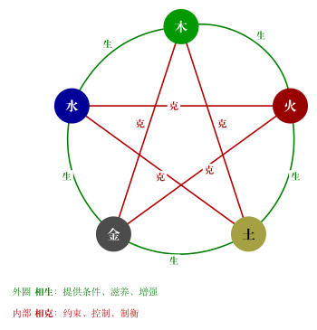

# 五行相克

## 核心结论

相克不是消灭，而是约束、控制、限制、制衡。木克土 = 生长突破稳定，土克水 = 边界限制流动，水克火 = 冷静压制冲动，火克金 = 热烈冲击规则，金克木 = 规则裁剪生长。适度的克是管理，过度的克是伤害。

## 基本概念

### 相克顺序

```
木 → 土 → 水 → 火 → 金 → 木
```

### 逐条理解

| 相克关系 | 解释 |
|----------|------|
| 木克土 | 生长突破稳定。树根能穿透土壤，生发的力量可以打破固化的结构。 |
| 土克水 | 边界限制流动。堤坝约束洪水，稳定的结构限制泛滥。 |
| 水克火 | 冷静压制冲动。水能灭火，深沉和冷静可以抑制过度的炽热。 |
| 火克金 | 热烈冲击规则。火能熔化金属，激情和爆发可以打破僵硬的规则。 |
| 金克木 | 规则裁剪生长。斧头砍树，规则和规范可以约束无序的生长。 |


> 上图展示五行生克全貌，综合参考。



> 上图展示五行生克全貌，综合参考。

## 对应关系

| 克者 | 被克者 | 关系性质 |
|------|--------|----------|
| 木 | 土 | 木制约土 |
| 土 | 水 | 土制约水 |
| 水 | 火 | 水制约火 |
| 火 | 金 | 火制约金 |
| 金 | 木 | 金制约木 |

## 现代理解

相克 = 制衡机制。任何一个健康的系统都需要制衡：

- **企业管理**：创新（木）需要规章制度（金）来约束无序扩张；制度太僵硬（金过强），又需要激情和变革（火）来冲破。同时稳定的运营体系（土）需要防止过度冒险（水）。
- **个人成长**：野心和冲劲（木）需要自律（金）来约束；自律太僵化又需要热情（火）来融化；热情过头需要冷静（水）来降温。

## 易错点

- **相克不等于坏**：适度的克是必要的管理。没有土克水，洪水就会泛滥；没有金克木，植物就会疯长。克是自然的调控机制。
- **"谁克谁"不是固定的强弱关系**：金克木，但如果木太旺金太衰，反而是木反侮金（反克）。下一篇会详讲旺衰。
- **别把克当成消灭**：克是限制和约束，不是消灭。土克水不是把水变没了，而是给水划定了边界。

## 速记

- 相克口诀：**木土水，火金木**（隔一个相克）
- 一句话：克 = 约束、控制、制衡
- 木→土（生破稳）、土→水（边限流）、水→火（冷制热）、火→金（热熔规）、金→木（规裁长）

## 相关笔记

- [五行基础](/docs/foundations/03-five-elements.md)
- [五行相生](/docs/foundations/04-five-elements-generation.md)
- [生克、通关与旺衰](/docs/foundations/06-generation-control-strength.md)
- [速查表](/docs/foundations/tables.md)
