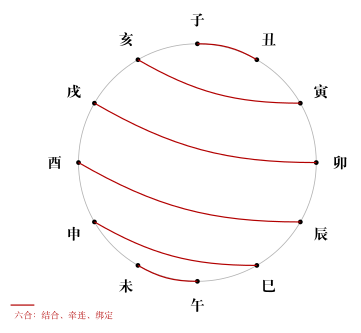
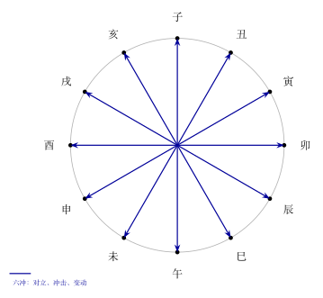

# 地支六合与六冲

## 核心结论

六合是地支之间的结合、牵连、绑定关系。六冲是地支之间的冲击、变动、分离关系。合不一定吉，冲不一定凶，关键在于作用到谁，以及旺衰和问题背景。

## 基本概念

**六合**

| 六合 | 合化五行 | 备注 |
|------|----------|------|
| 子丑合 | 土 | 传统固定配组，是否真能合化要看条件 |
| 寅亥合 | 木 | 传统固定配组，是否真能合化要看条件 |
| 卯戌合 | 火 | 传统固定配组，是否真能合化要看条件 |
| 辰酉合 | 金 | 传统固定配组，是否真能合化要看条件 |
| 巳申合 | 水 | 传统固定配组，是否真能合化要看条件 |
| 午未合 | 土 | 传统固定配组，是否真能合化要看条件 |

合 = 结合、合作、黏住、牵连。六个组合，所以叫六合。

**六冲**

| 对冲 | 方向对立 |
|------|----------|
| 子午冲 | 北 vs 南（水 vs 火） |
| 丑未冲 | 东北 vs 西南（土 vs 土） |
| 寅申冲 | 东北 vs 西南（木 vs 金） |
| 卯酉冲 | 东 vs 西（木 vs 金） |
| 辰戌冲 | 东南 vs 西北（土 vs 土） |
| 巳亥冲 | 东南 vs 西北（火 vs 水） |

冲 = 冲击、变动、分离、打开、破局。两个地支在地理方位上正好相对。

> 上图展示六对地支两两相合的关系，红色弧线连接。

## 对应关系

六合和六冲都是两两地支之间的基本关系，它们描述了地支相遇时的动态：

- 合：两个地支走到一起，形成一股合力
- 冲：两个地支正面碰撞，产生变动

在判断中，合冲要看：

- 作用到谁：是好的因素被合被冲，还是坏的因素被合被冲？
- 旺衰：力量对比如何？强者冲弱者一冲就散，弱者冲强者如螳臂当车。
- 问题背景：问事业时冲可能是变动，问感情时冲可能是分离。

> 上图展示六对地支对冲冲克的关系，蓝色箭头直穿圆心。

## 现代理解

合和冲像人际关系中的两种状态：

- **合**：两个人搭班子做事，配合得好是强强联合，配合得不好就是纠缠拉扯。
- **冲**：两个人正面冲突，可能是一次性的大变动（如离职、搬迁），也可能是破坏性的对抗。

在组织管理中，合像是团队协作，冲像是组织重组。两个各有好坏，看时机和对象。

## 易错点

- **合不一定好**：如果被合的是不利因素，合反而把麻烦"绑定"住了，更不容易摆脱。比如不好的东西被合，它会黏着不走。
- **冲不一定坏**：如果被冲的是不利因素，冲反而是好事——把不好的东西冲开、冲走。比如困局被冲，可能是破局的机会。
- **六合化五行不是自动发生的**：子丑合土是有条件的，不是说子丑一见面就一定化土。

## 速记

**六合口诀**：子丑合、寅亥合、卯戌合、辰酉合、巳申合、午未合
**六冲口诀**：子午冲、丑未冲、寅申冲、卯酉冲、辰戌冲、巳亥冲

一个字：合 = 黏，冲 = 撞

## 相关笔记

- [十二地支](/docs/foundations/08-earthly-branches.md)：地支的基本属性
- [三合局与三会局](/docs/foundations/11-three-harmony-and-three-meetings.md)：三个地支的合局
- [速查表](/docs/foundations/tables.md)：六合表、六冲表
- [术语表](/docs/foundations/glossary.md)：六合、六冲
- [地支刑、害、破](/docs/foundations/12-punishment-harm-break.md)：刑害破的关系
