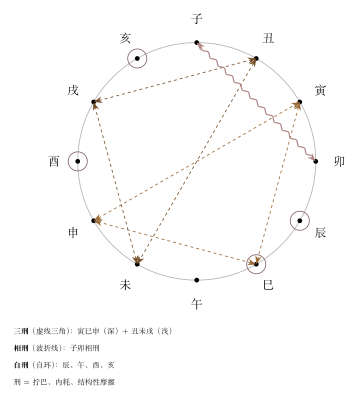
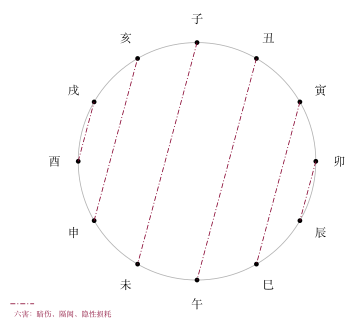
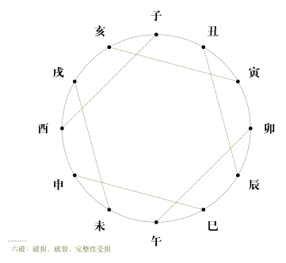
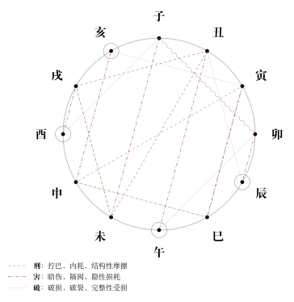

# 地支刑、害、破

## 核心结论

刑、害、破是地支之间除了合、冲之外的三种关系。它们通常不像合冲那样直接显著，但各自代表不同类型的摩擦、损耗或结构不顺：刑偏拧巴内耗，害偏暗伤掣肘，破偏结构损坏。三者都是基础配置，初学阶段重点记组合，不必追求精细断法。

## 基本概念

在地支世界中，除了合（结合、合作）和冲（对立、碰撞），还存在三种更微妙的不利关系：

- **刑**：约束、拧巴、内耗、别扭
- **害**：暗伤、隔阂、误解、彼此损耗
- **破**：破坏、破裂、破损、拆散

与合冲相比，这三者在实际判断中一般不作为第一优先级，但它们是细化判断时的重要补充。

## 地支相刑

刑的关键词：**约束、拧巴、内耗、别扭、惩罚、自我消耗、结构性摩擦**。

**刑和冲的区别**

| 对比 | 冲 | 刑 |
|------|-----|-----|
| 作用方式 | 正面碰撞、对撞 | 内部拧巴、慢性摩擦 |
| 表现 | 明显、突发、变动大 | 隐晦、持续、反复消耗 |
| 类比 | 两车对撞 | 齿轮卡住、不断空转 |

**相刑分类**

| 类型 | 组合 | 关键词 |
|------|------|--------|
| 三刑 | 寅巳申 | 结构复杂、动态内耗 |
| 三刑 | 丑未戌 | 土性僵持、挤压迟滞 |
| 相刑 | 子卯 | 别扭、相互掣肘 |
| 自刑 | 辰午酉亥 | 自我消耗、自我反复 |

> 关于"三刑"：不同流派有各自的细分说法（如无礼之刑、无恩之刑、恃势之刑等）。当前笔记先采用最常见、最便于入门记忆的一版组合，初学阶段重点记组合，不必过早卷入不同派别争论。

**逐条理解**

- **寅巳申三刑**：可以理解为结构复杂、彼此牵制、动态内耗。寅（木）生巳（火），巳（火）克申（金），申（金）又克寅（木），三个地支互相咬合，形成一种"谁都不舒服但谁也离不开"的僵局。
- **丑未戌三刑**：三个都是土性地支，理解为同性质力量之间的挤压、僵持、迟滞。像三个部门各有职责范围，互相卡位、互不妥协。
- **子卯相刑**：子（水）生卯（木）本是相生关系，但在特定条件下形成不协调——可以理解为秩序（子水之正）与情绪（卯木之柔）之间的别扭冲突，有"好心办坏事"的意味。
- **辰午酉亥自刑**：四个地支各自"自己刑自己"。可以理解为同类力量反向作用于自身，带有"自己跟自己过不去"、"反复纠结"、"自我否定"的意味。命局中同一地支多次出现时，这种内耗倾向被认为更明显。

以上解释属于象意理解和辅助记忆，不是绝对断语。

> 上图展示寅巳申三刑、丑未戌三刑、子卯相刑、辰午酉亥自刑四种关系。

## 地支相害

害的关键词：**暗伤、隔阂、误解、彼此损耗、隐性冲突**。表面不一定正面对撞，但会造成不舒适影响。

**害和冲的区别**

| 对比 | 冲 | 害 |
|------|-----|-----|
| 表现 | 直接、明显、正面 | 隐蔽、阴损、侧面 |
| 感受 | 知道撞上了 | 总觉得不舒服但说不清 |
| 结果 | 可能破局或分离 | 长期消耗、关系不顺 |

**六害表**

| 六害 | 关键词 |
|------|--------|
| 子未害 | 暗伤、掣肘 |
| 丑午害 | 内部不合、别扭 |
| 寅巳害 | 隐性冲突 |
| 卯辰害 | 不协调、关系不顺 |
| 申亥害 | 潜在牵制 |
| 酉戌害 | 隐性损耗 |

> 上图展示六对地支相害关系，紫色点划线连接。

## 地支相破

破的关键词：**破坏、破裂、破损、拆散、失去完整性**。

**破 v.s. 冲 v.s. 害**

| 对比 | 冲 | 害 | 破 |
|------|-----|-----|-----|
| 程度 | 激烈对撞 | 暗伤消耗 | 结构损坏 |
| 结果 | 变动、分离 | 长期不顺 | 破裂、不完整 |

破更像"结构被拆"：不是对抗（冲），不是暗损（害），而是完整性被打破。拼图缺了一块。

**六破表**

| 六破 | 关键词 |
|------|--------|
| 子酉破 | 破裂、受损 |
| 丑辰破 | 结构破损 |
| 寅亥破 | 协调被破 |
| 卯午破 | 节奏受损 |
| 申巳破 | 组合破裂 |
| 戌未破 | 土性结构破坏 |

> 上图展示六对地支相破关系，绿色密集点线连接。

> 上图将刑、害、破三种关系放在一张图中，便于复习对比。

## 现代理解

用现代人际和组织类比来记忆三者的区别：

- **冲**：两个部门公开冲突，拍桌子吵架，全公司都知道。
- **刑**：两个人合作关系，但做事方式根本对不上，每天互相磨损，效率极低但表面还在合作。
- **害**：两个人表面客气，实际上各有算计，暗中互相拆台，外人看不出问题。
- **破**：合作关系已经出现了明显的裂痕，虽然还没正式散伙，但信任已经碎了。

## 易错点

- **刑、害、破不是一定有吉凶事件**：它们描述的是关系倾向和潜在摩擦，不是"出现就倒霉"。很多人的命局或卦中都有这些组合，但并不一定引发大事。
- **不要把刑、害、破跟合冲等量齐观**：合冲是第一梯队的核心关系（在大多数术数体系中），刑害破一般是辅助判断因素。初学阶段不用过度紧张每个刑害破。
- **相刑不等于法律上的刑罚**：刑在这里是"拧巴、内耗"的意思，不要望文生义联想到坐牢或法律惩罚。
- **自刑不等于精神疾病**：辰午酉亥自刑是地支关系的细分概念，不要直接引申为心理疾病诊断。

## 速记

- **刑**口诀：寅巳申、丑未戌、子卯相刑，辰午酉亥自刑自己。
- **害**口诀：子未、丑午、寅巳、卯辰、申亥、酉戌，六害暗中伤。
- **破**口诀：子酉、丑辰、寅亥、卯午、申巳、戌未，六破结构碎。

## 相关笔记

- [十二地支](/docs/foundations/08-earthly-branches.md)：地支的基本属性
- [地支六合与六冲](/docs/foundations/10-six-combinations-and-six-clashes.md)：合与冲的完整对比
- [三合局与三会局](/docs/foundations/11-three-harmony-and-three-meetings.md)：三合、三会、半合
- [速查表](/docs/foundations/tables.md)：刑害破速查
- [术语表](/docs/foundations/glossary.md)：刑、害、破
